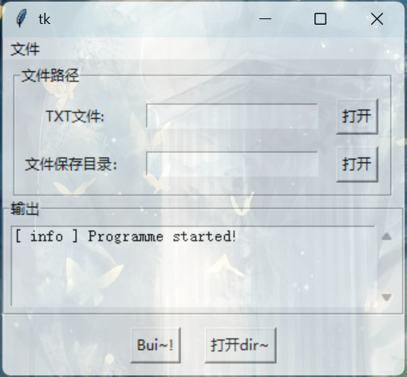
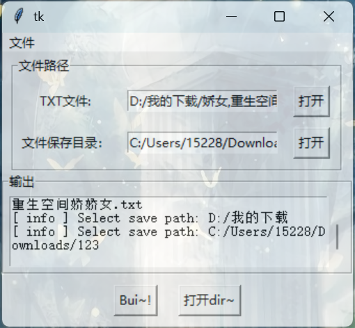
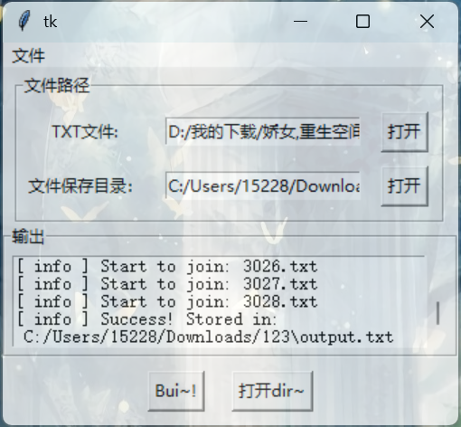

## TXT 自动分章、排序~
   

## 通知

软件将会在近期使用~~Flutter~~ Qt6 重构来获取更好的兼容性。参考[这个页面](https://github.com/ganyuanzhen/TXT-Automatic-Chaptering/milestone/1)以获取更详细的信息。

在更新期间，所有有关旧版本的Issue和Pr将不会再被查看，特殊情况除外。

当前版本使用建议：
**不要使用autobuild**！！！
可以试一下beta1、2、3。如果报错的话，可以复制或截图发在Issues里面，咱会查看的~

### 前言
由于我喜欢看网文，但又不想付...， 所以从各种网站爬虫下载TXT。

但是...有很多都是乱序的喵！>_<

于是，我在伟大的度娘上找呀找...发现并没有能用的软件。

所以，便有了这个！

### 软件截图

<figure class="third">
    
    
    
</figure>

### 已知问题 Known issues.
 - 仅能处理部分格式的章节——章节后面有一个空格的那种
 - <s>章节序号是汉字的不能处理 >_< </s> 正在测试中！！
 - ......

### 贡献 How to contribute?
欢迎大家提出issue和pullrequest！
会尽可能在第一时间处理~~

### Final
Provide by Yinan Qin with ♥
